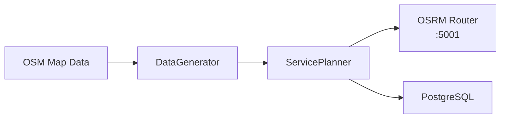
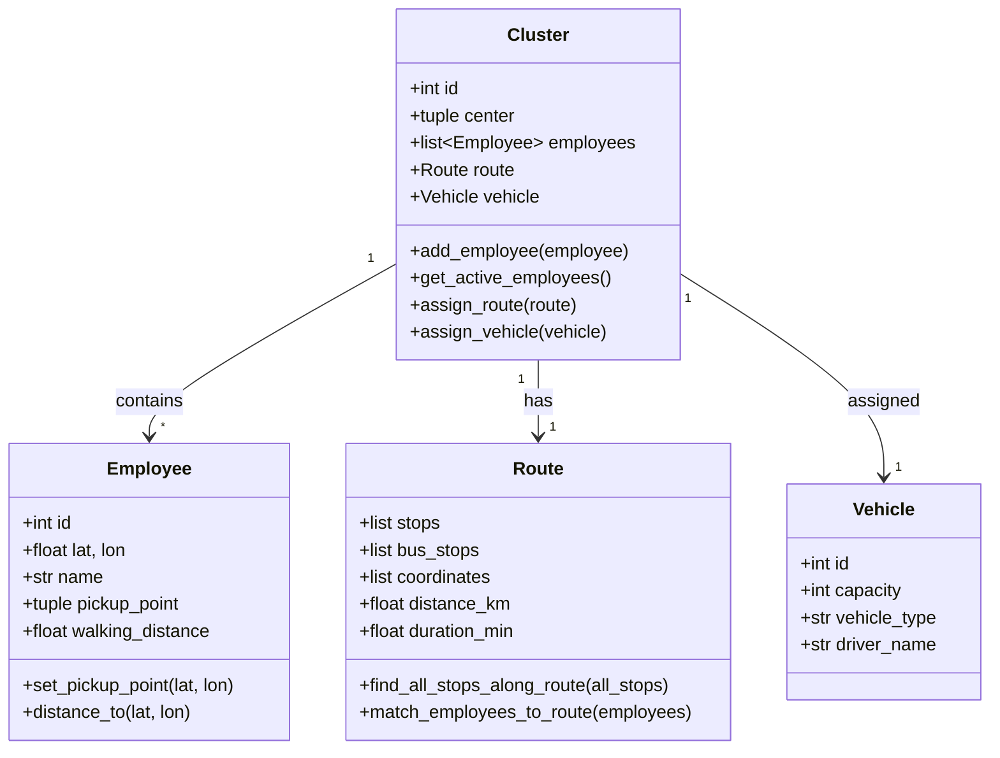
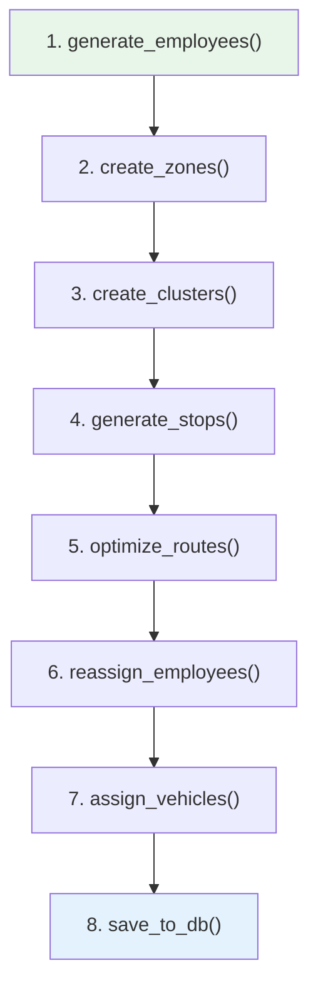
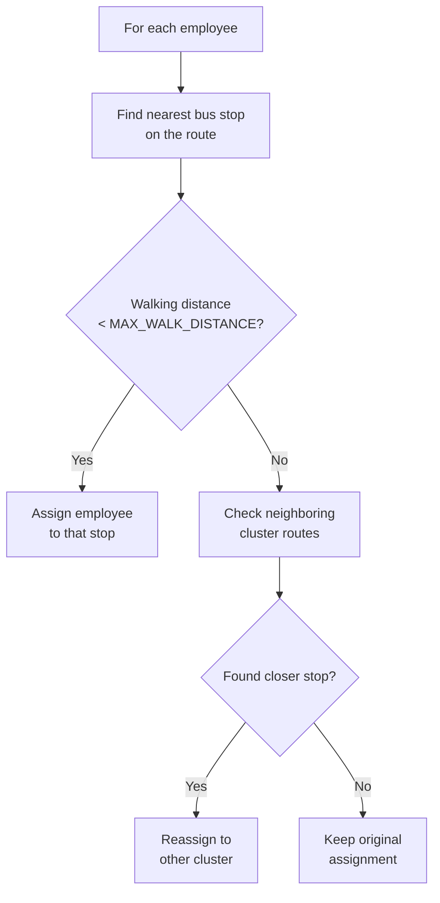
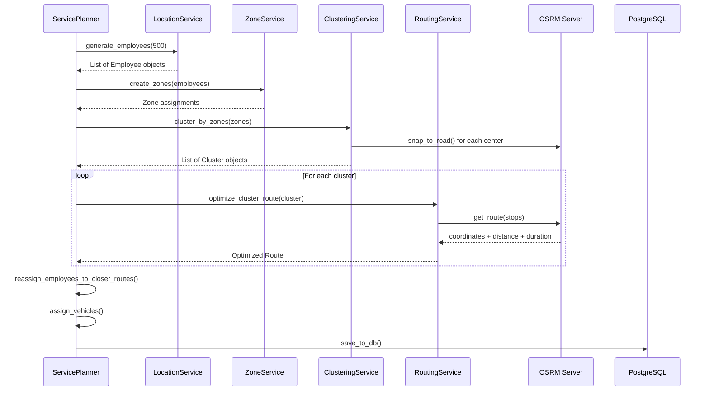
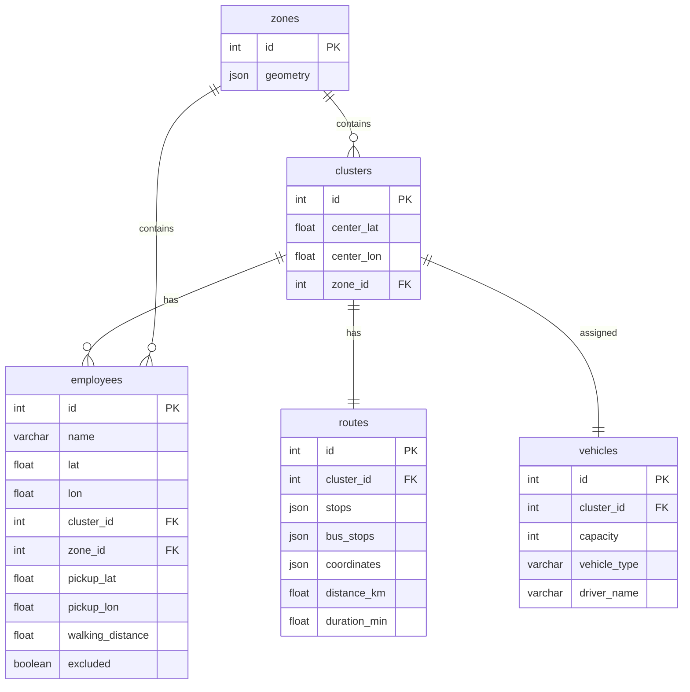

# Route Optimization Engine — Architecture Document

## System Overview

The routing engine generates optimized shuttle routes for employees. It takes employee GPS locations, groups them into clusters, finds bus stops along optimal driving paths, and assigns each employee to the nearest stop.

---

## Domain Models (`models.py`)

---

## Route Generation Pipeline

The `ServicePlanner` class orchestrates the full pipeline:

### Step-by-Step

| # | Method | Service Used | What It Does |
|---|--------|-------------|-------------|
| 1 | `generate_employees()` | LocationService | Generates random employee locations within OSM residential areas, or loads from database |
| 2 | `create_zones()` | ZoneService | Splits the map into walkable zones using major road barriers (highways, motorways) so employees don't have to cross them |
| 3 | `create_clusters()` | ClusteringService | Groups employees within each zone using **KMeans clustering**, then enforces vehicle capacity constraints |
| 4 | `generate_stops()` | Route | Finds real bus stops (from OSM) that fall within a buffer of each cluster's route path |
| 5 | `optimize_routes()` | RoutingService → OSRM | Sends stop coordinates to OSRM to get the optimal driving route (distance, duration, polyline) |
| 6 | `reassign_employees()` | ServicePlanner | If an employee is too far from their assigned stop, checks if a closer stop exists on a neighboring cluster's route |
| 7 | `assign_vehicles()` | ServicePlanner | Creates a vehicle for each cluster based on `VEHICLE_CAPACITY` |
| 8 | `save_to_db()` | Repositories | Persists employees, clusters, routes, vehicles, and zones to PostgreSQL |

---

## Service Responsibilities

### LocationService
Generates employee locations using OpenStreetMap data.
- `generate_employees(count)` — random points within residential areas
- `get_transit_stops()` — extracts bus stop coordinates from OSM

### ClusteringService
Groups employees into shuttle-sized clusters.
- `cluster_employees(employees, n)` — KMeans on GPS coordinates
- `cluster_by_zones(zones)` — per-zone clustering
- `snap_centers_to_roads(clusters)` — moves cluster centers to the nearest road via OSRM
- `enforce_capacity_constraints(clusters, cap)` — splits oversized clusters

### RoutingService
Calculates optimized driving routes.
- `optimize_cluster_route(cluster)` — sends cluster stops to OSRM, gets the optimal route with coordinates, distance, and duration

### ZoneService
Partitions the map using road barriers.
- `load_barrier_roads()` — extracts highway/motorway geometries from OSM
- `create_zones(employees)` — Voronoi-like partitioning around barriers
- `assign_employees_to_zones(employees)` — assigns zone_id to each employee

---

## OSRM Router (`routing.py`)

Communicates with the self-hosted OSRM Docker container.

| Method | Purpose |
|--------|---------|
| `get_route(points, profile)` | Optimal route through waypoints → returns `{coordinates, distance_km, duration_min}` |
| `get_distance_matrix(origins, dests)` | Walking distance matrix between employees and stops |
| `snap_to_road(lat, lon)` | Snaps a coordinate to the nearest road |

Results are cached in `APICache` (file-based JSON) to avoid redundant API calls.

---

## Key Algorithms

### Employee-to-Stop Matching (`Route.match_employees_to_route`)

### Bus Stop Discovery (`Route.find_all_stops_along_route`)
1. Build a Shapely `LineString` from route coordinates
2. Buffer the line by `ROUTE_STOP_BUFFER_METERS` (default: 30m)
3. Filter all OSM bus stops that fall within the buffer
4. Optionally filter to same-side-of-road stops only
5. Order stops by position along the route

---

## Configuration (`config.py`)

| Parameter | Default | Description |
|-----------|---------|-------------|
| `NUM_EMPLOYEES` | 500 | Employees to generate |
| `EMPLOYEES_PER_CLUSTER` | 17 | Max per shuttle |
| `MAX_WALK_DISTANCE` | 1000m | Max walk to a stop |
| `ROUTE_STOP_BUFFER_METERS` | 15m | Distance from route to assign stops |
| `BUS_STOP_DISCOVERY_BUFFER_METERS` | 30m | Distance to discover stops along route |
| `OPTIMIZATION_MODE` | balanced | `budget` / `balanced` / `employee` |

### Optimization Modes

| Mode | Cluster Size | Walk Distance | Effect |
|------|-------------|---------------|--------|
| **budget** | 25 | 1500m | Fewer vehicles, longer walks |
| **balanced** | 17 | 1000m | Default |
| **employee** | 10 | 500m | More vehicles, shorter walks |

---

## Data Flow

---

## Database Schema

